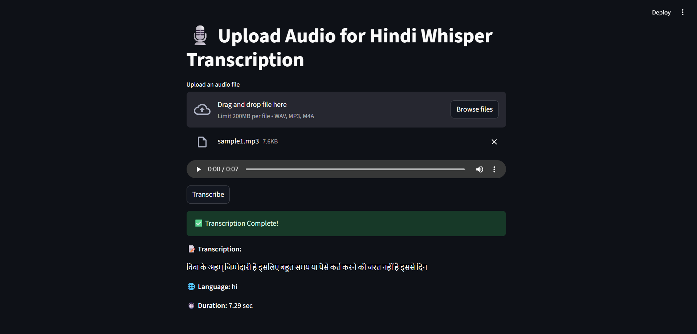
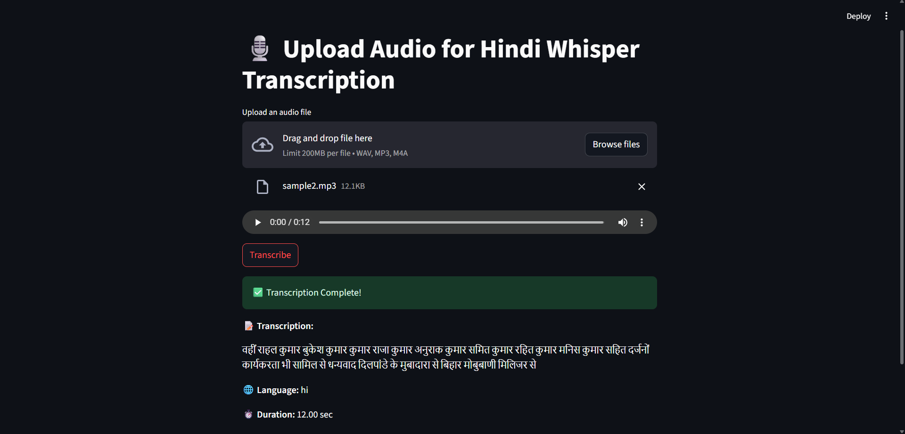
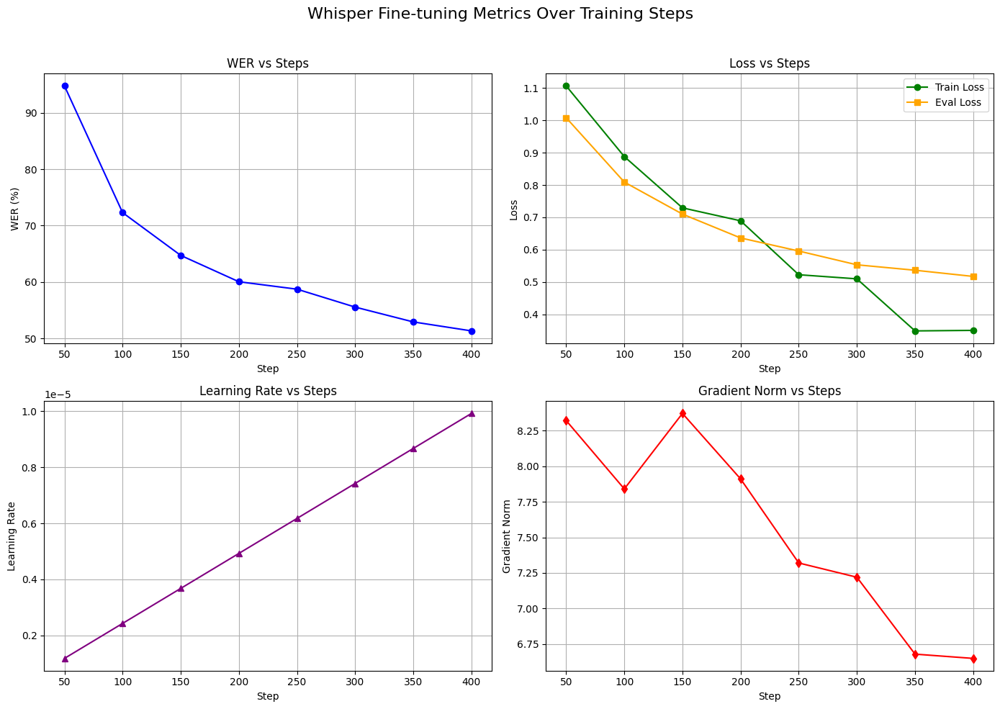
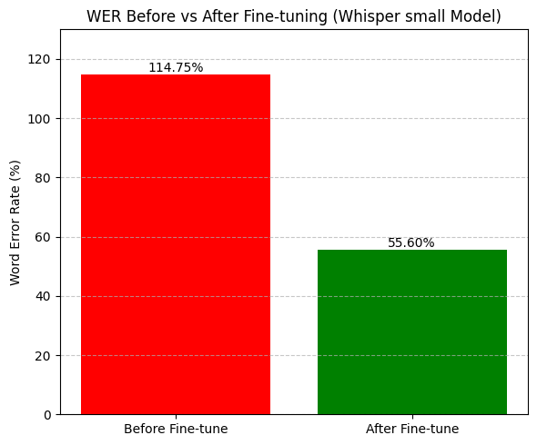
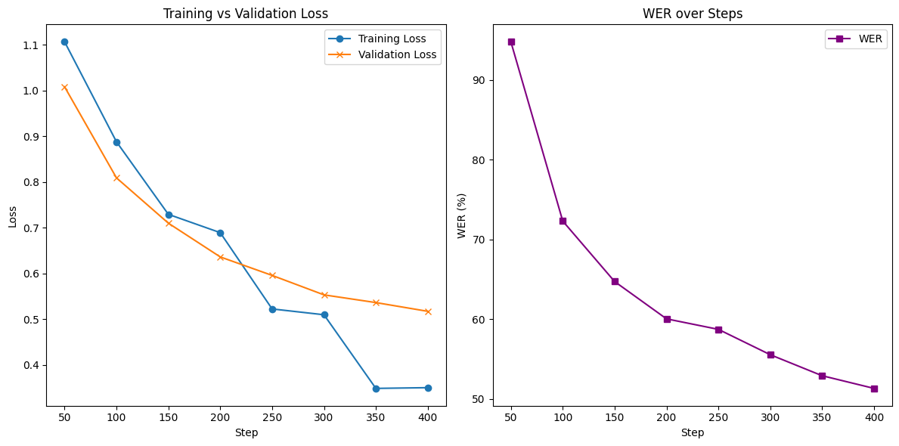

# 🚀 FastTuneWhisper

**FastTuneWhisper** is a production-ready transcription system that uses a fine-tuned Whisper model with optimized CTranslate2 backend for **fast and accurate inference**, deployed via FastAPI with a **Streamlit-based frontend**.

## 📸 Project Screenshots

<p align="center">
    
    <br>
    <em>Figure: demostration screenshot-1 of FastTuneWhisper</em>
</p>


<p align="center">
    
    <br>
    <em>Figure: demostration screenshot-2 of FastTuneWhisper</em>
</p>

## 📦 Project Structure

```
FastTuneWhisper/
├── backend/
│   └── main.py              # FastAPI server for transcription
├── frontend/
│   └── app.py               # Streamlit UI for uploading and transcribing audio
├── models/
│   └── ctranslate2-whisper-hindi-custom-model/  # Quantized Whisper model
├── notebook/
│   └── fine_tune_whisper_model.ipynb  # Fine-tuning workflow
├── sample/
│   └── audio_samples/       # Example audio files
├── img/
│   └── *.png                # Model training result visualizations
└── README.md
```

## ⚙️ Backend: FastAPI Inference Server

```bash
cd backend
uvicorn main:app --reload --port 8000
```

* Accepts audio uploads via `/transcribe/` POST endpoint
* Preprocesses audio to 16kHz mono WAV
* Uses **Faster-Whisper** with CTranslate2 for efficient transcription
* Returns: `transcription`, `language`, and `duration`

## 🖥️ Frontend: Streamlit UI

```bash
cd frontend
streamlit run app.py
```

* Uploads `.wav`, `.mp3`, or `.m4a` audio files
* Sends request to FastAPI server
* Displays transcription, language, and duration in UI


## 🧠 Model Info

* Base model: [`openai/whisper-small`](https://huggingface.co/openai/whisper-small)
* Fine-tuned on Hindi custom dataset (see `notebook/fine_tune_whisper_model.ipynb`)
* Exported to [CTranslate2](https://github.com/OpenNMT/CTranslate2) format with quantization: `int8`


## 📊 Model Training Results

Some results from fine-tuning Whisper on a domain-specific dataset:

| Metric                     | Observation                                                               |
| -------------------------- | ------------------------------------------------------------------------- |
| **WER vs Steps**           | Shows consistent improvement, decreasing from \~94.78% to \~51.32%.       |
| **Loss vs Steps**          | Both training and evaluation losses steadily decrease over time.          |
| **Learning Rate vs Steps** | Learning rate increases over training as expected in warm-up scheduling.  |
| **Gradient Norm vs Steps** | Gradual reduction indicates stable training dynamics.                     |
| **Before vs After WER**    | Word Error Rate dropped from **114.75%** to **55.60%** after fine-tuning. |

<p align="center">
  
  <br>
  <em>Figure: Fine-tuning metrics - WER, Loss, LR, and Grad Norm over steps</em>
</p>

<p align="center">
  
  <br>
  <em>Figure: Word Error Rate Before vs After Fine-tuning</em>
</p>

<p align="center">
  
  <br>
  <em>Figure: Training & Validation Loss and WER trend</em>
</p>

> 📌 Note: The Whisper model used is `small`, fine-tuned on a custom Hindi dataset. Results may vary with different domains or languages.


## 🛠️ Requirements

Install all necessary dependencies:

```bash
pip install fastapi uvicorn streamlit torch torchaudio soundfile faster-whisper requests
```


## 📌 Sample Usage

1. Start the **FastAPI** server:

   ```
   cd backend
   uvicorn main:app --reload --port 8000
   ```

2. Open the **Streamlit** app:

   ```
   cd frontend
   streamlit run app.py
   ```

3. Upload an audio file and click "Transcribe" to view results.


## 🧪 Example Output

**Input**: `sample/audio_samples/example.wav`
**Output**:

```
📝 Transcription: नमस्ते, यह एक हिंदी ऑडियो ट्रांसक्रिप्शन उदाहरण है।
🌐 Language: hi
⏱️ Duration: 12.47 sec
```


## 📁 Notebook

* `notebook/fine_tune_whisper_model.ipynb`: Complete guide to fine-tune Whisper on your own dataset, export to CTranslate2, and run benchmarks.


## 📝 Licens
MIT License  [MIT](https://github.com/abhi-soni/FastTuneWhisper/blob/main/LICENSE)